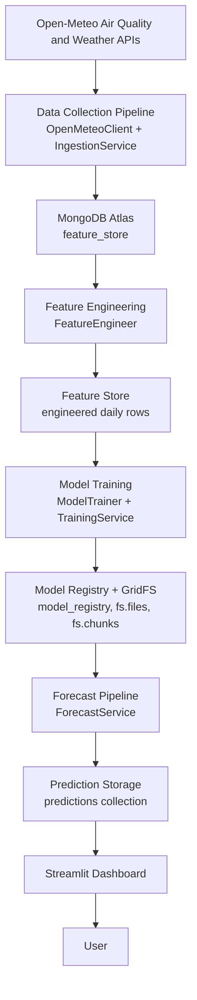
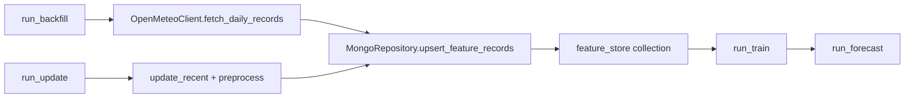
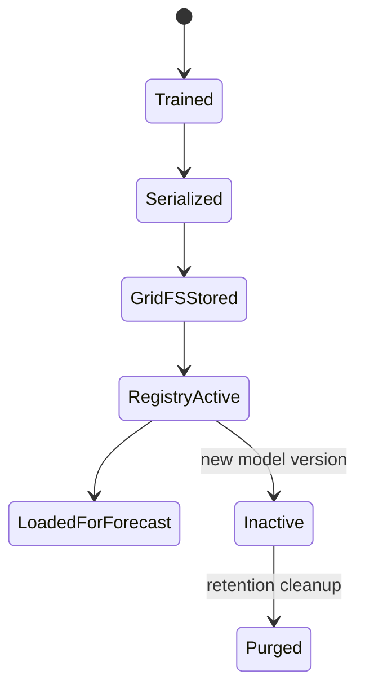
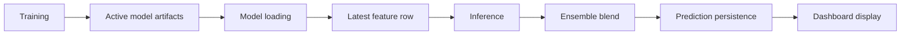
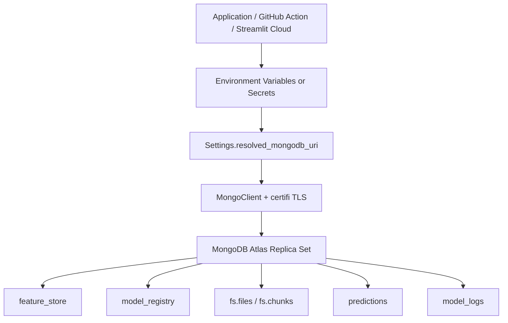
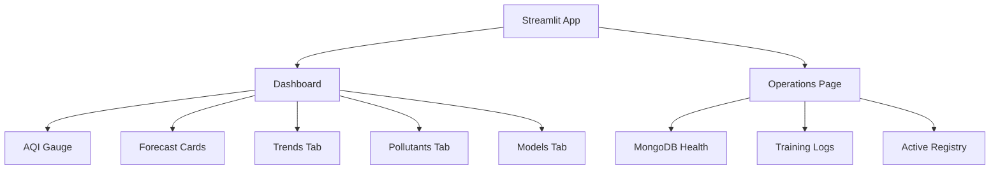
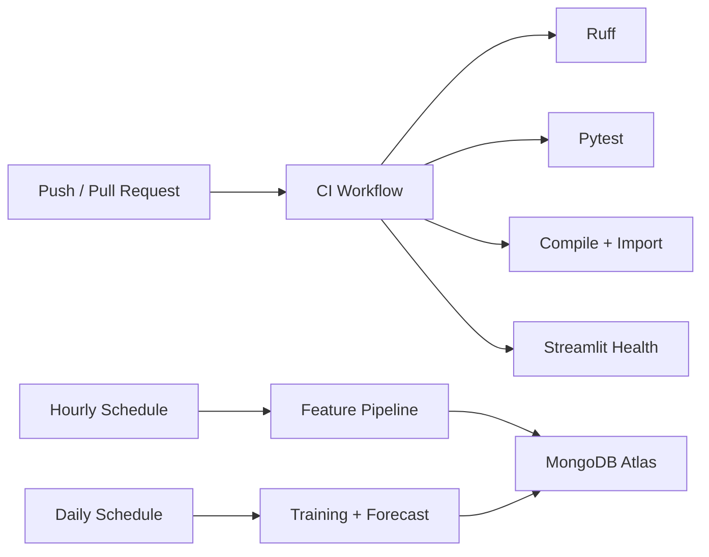
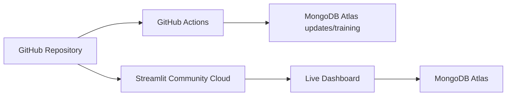

# Karachi AQI Prediction System

## Live Application
https://qzv6dgclvfa8ehvevwmsnb.streamlit.app/

This is the deployed production version of the project.

# 1. Executive Summary

The Karachi AQI Prediction System is a production-oriented Streamlit and machine learning application that forecasts air quality for Karachi, Pakistan. Its purpose is to collect environmental and air-pollution data, transform it into a reusable feature store, train forecasting models, persist model artifacts in MongoDB Atlas, generate four-day AQI predictions, and present the results through an interactive dashboard.

AQI prediction matters because air pollution directly affects public health, outdoor activity, transport planning, and risk communication. A short-term forecast helps users understand whether air quality is likely to remain acceptable, become unhealthy, or require caution. This project focuses on a practical forecasting workflow rather than a static notebook: data collection, feature engineering, training, artifact storage, prediction persistence, dashboard display, and scheduled automation are all represented in the codebase.

At a high level, the system is organized as a Python package named `karachi_aqi/`, with Streamlit entry points in `app.py` and `pages/1_Operations.py`. MongoDB Atlas is used for cloud persistence. PyMongo and GridFS support feature storage, model registry storage, training logs, ensemble configuration, predictions, and large serialized model artifacts. Scikit-learn provides the model implementations, Pandas and NumPy power feature engineering, Plotly renders visualizations, and GitHub Actions automate validation and scheduled pipelines.

# 2. Project Objectives

The project objectives are implemented across several modules rather than in a single script. AQI forecasting is handled by the training and forecast services in `karachi_aqi/services/training.py` and `karachi_aqi/services/forecasting.py`. The automated data pipeline is exposed through runnable modules in `karachi_aqi/pipelines/`: `run_backfill.py`, `run_update.py`, `run_train.py`, and `run_forecast.py`.

Feature engineering is implemented in `karachi_aqi/features/engineering.py`. It converts daily observations into lag, rolling, seasonal, interaction, lead, and target features. Machine learning model training is implemented in `karachi_aqi/models/training.py`, with model definitions in `karachi_aqi/models/specs.py`. The model registry is implemented through MongoDB collections and GridFS in `karachi_aqi/models/artifacts.py`.

Forecast generation loads active models, applies the latest feature row, blends predictions using stored ensemble weights, and writes forecast documents to MongoDB. The cloud database objective is met by `karachi_aqi/data/mongo.py`, which centralizes MongoDB access. The Streamlit dashboard objective is met by `karachi_aqi/ui/dashboard.py` and the Operations page. CI/CD automation is represented in `.github/workflows/ci.yml`, `.github/workflows/feature_pipeline.yml`, and `.github/workflows/training_pipeline.yml`.

# 3. Complete System Architecture

The architecture is intentionally layered. `OpenMeteoClient` retrieves hourly air-quality and weather data, then aggregates it into daily records. `MongoRepository` stores those records in MongoDB Atlas. `FeatureEngineer` reads the stored records, creates model-ready features, and writes the engineered values back to the same feature store. `TrainingService` reads labeled feature rows, trains the configured model families, computes ensemble weights, and persists active models. `ForecastService` loads the latest active models and ensemble configuration to generate four-day predictions. Streamlit reads the latest feature rows, model metadata, and prediction documents for display.

# 4. Project Folder Structure

| Path | Purpose |
|---|---|
| `.github/` | GitHub Actions workflows for CI, scheduled feature refresh, and scheduled training/forecasting. |
| `.streamlit/` | Streamlit runtime configuration and `secrets.toml.example` for cloud deployment. |
| `docs/` | Architecture, deployment, diagnostics, migration, verification, and model replacement documentation. |
| `karachi_aqi/` | Main Python package containing configuration, data access, features, models, services, pipelines, and UI code. |
| `pages/` | Streamlit multipage extension. `1_Operations.py` provides MongoDB health and operational tables. |
| `scripts/` | Thin command wrappers and diagnostics such as `diagnose_mongodb.py` and `minimal_mongodb_ping.py`. |
| `tests/` | Pytest tests for settings, feature engineering, and model construction. |
| `.env.example` | Local environment variable template without real credentials. |
| `.gitignore` | Excludes `.env`, virtual environments, caches, Streamlit secrets, archives, and generated artifacts. |
| `app.py` | Streamlit application entry point that calls `render_dashboard()`. |
| `README.md` | Setup, verification, pipeline, and deployment summary. |
| `DEPLOYMENT.md` | Top-level pointer to deployment instructions. |
| `STREAMLIT_SETUP.md` | Streamlit Community Cloud setup guide. |
| `requirements.txt` | Python dependency set for local, CI, and cloud environments. |

The GitHub repository also includes `runtime.txt` (`python-3.11`), `packages.txt` for system libraries, and `.devcontainer/devcontainer.json` for a containerized development environment.

# 5. Data Pipeline

The data pipeline begins in `karachi_aqi/data/open_meteo.py`. `OpenMeteoClient` calls Open-Meteo air-quality, weather archive, and weather forecast endpoints. It requests AQI, PM2.5, PM10, NO2, SO2, CO, O3, aerosol optical depth, dust, UV index, temperature, humidity, precipitation, wind, pressure, boundary layer height, cloud cover, and radiation values. Hourly responses are merged on timestamp and averaged into daily records.

`IngestionService` in `karachi_aqi/services/ingestion.py` controls how data enters MongoDB. `backfill()` fetches a historical date range. `update_recent()` refreshes recent observations; if no data exists, it defaults to a one-year fetch. `preprocess()` loads feature rows, optionally fetches forecast lead data, applies `FeatureEngineer`, converts the dataframe to MongoDB-safe records, and upserts them.

The runnable pipeline modules are:

- `run_backfill.py`: loads historical data from `BACKFILL_START_DATE` through yesterday.
- `run_update.py`: updates recent raw rows, engineers features, and writes engineered rows.
- `run_train.py`: trains models and persists registry artifacts.
- `run_forecast.py`: generates and stores the latest forecast document.

# 6. Feature Engineering and Feature Store

Feature engineering is concentrated in `karachi_aqi/features/engineering.py`. The pipeline first validates the presence of a `date` column, sorts records, removes duplicate dates, creates a complete daily calendar, and forward-fills missing dates. Outliers are capped using an IQR rule for selected pollutant and weather columns.

Transformations include pollutant logs (`log_PM2_5`, `log_CO`, `log_PM10`), wind direction sine/cosine components, calendar values, cyclical month/day/weekday encodings, and season flags. The code also creates AQI lags for 1, 2, 3, 7, and 14 days; rolling means, standard deviations, minimums, and maximums; exponentially weighted moving averages; AQI differences; pollutant/weather lags; and rolling pollutant means.

Environmental combinations are also generated: dew point, heat-index proxy, stagnant-air flag, dry-windy flag, AQI high flag, `PM2_5_x_Humidity`, `PM2_5_x_stagnant`, `CO_x_Temperature`, `AQI_x_wind`, `AQI_x_month_sin`, and `dust_x_wind`. Lead columns such as `Temperature_t1` through `Temperature_t4` and target columns `AQI_t+1` through `AQI_t+4` support multi-day forecasting.

The feature store is implemented as the MongoDB `feature_store` collection. It contains both source-like daily values and engineered columns, keyed by unique `date` indexes created by `MongoRepository.ensure_indexes()`.

# 7. Machine Learning Models

Models are declared in `karachi_aqi/models/specs.py` and trained by `ModelTrainer` in `karachi_aqi/models/training.py`. The system currently implements three models:

| Model | Implementation | Reason Selected |
|---|---|---|
| Extra Trees | `ExtraTreesRegressor` | Captures non-linear pollutant/weather interactions without LightGBM binary deployment complexity. |
| Histogram Gradient Boosting | `MultiOutputRegressor(HistGradientBoostingRegressor)` | Strong non-linear tabular model suitable for engineered daily features. |
| Elastic Net | `MultiOutputRegressor(ElasticNet)` | Stable regularized linear baseline with feature shrinkage. |

Training uses a time-aware holdout split: the latest 60 days form the holdout partition by default. Feature columns are numeric columns excluding date, `_id`, `processed_at`, and target columns. Missing feature values are filled with training medians. Elastic Net uses `StandardScaler`; the tree-based models use raw numeric feature values.

Final verified metrics from the live training run:

| Model | MAE | RMSE | R² |
|---|---:|---:|---:|
| Extra Trees | 3.9775 | 5.5849 | 0.8893 |
| Histogram Gradient Boosting | 3.6225 | 4.9206 | 0.9142 |
| Elastic Net | 3.7549 | 5.0182 | 0.9108 |
| Ensemble | 3.3962 | 4.6652 | 0.9229 |

MAE measures average absolute error in AQI units. RMSE penalizes larger errors more strongly. R² measures explained variance, where higher values indicate better fit on the holdout period.

The ensemble strategy is implemented in `karachi_aqi/models/ensemble.py`. It fits one non-negative least squares weight vector per forecast horizon and normalizes weights to sum to one. This means the ensemble can emphasize different component models for day 1, day 2, day 3, and day 4 forecasts.

# 8. Model Registry

A model registry is a controlled store for trained model versions, metadata, metrics, active/inactive status, and artifacts. In this project, registry metadata is stored in MongoDB `model_registry`, while model and scaler binaries are stored in GridFS through `fs.files` and `fs.chunks`.

`ModelArtifactStore.save()` serializes models with `pickle`, writes model and scaler bytes into GridFS, marks previous active models of the same type inactive, and inserts a new active metadata document. Metadata includes `model_type`, `version`, `trained_at`, `status`, `model_file_id`, `scaler_file_id`, `artifact_storage`, feature names, metrics, hyperparameters, and automation flag. `load_active()` retrieves the latest active model, loads GridFS files, unpickles artifacts, and returns model, scaler, and metadata.

The BSON 16MB limitation was a real engineering blocker documented in `docs/MONGODB_DIAGNOSTICS.md`: storing serialized estimators directly in one MongoDB document can exceed the BSON size limit. GridFS solved this by chunking large artifacts while keeping lightweight registry metadata queryable.

# 9. Prediction Pipeline

`ForecastService.generate()` in `karachi_aqi/services/forecasting.py` loads the latest labeled feature frame, retrieves `ensemble_config`, loads each active model in the ensemble order, prepares the latest feature row, fills missing values from stored feature medians, applies scaling where needed, and predicts a four-value vector. `blend_predictions()` combines component predictions using stored weights. The final prediction document is inserted into the MongoDB `predictions` collection with `predicted_at`, `model_type`, `anchor_date`, component model IDs, component predictions, and final forecast rows.

# 10. MongoDB Atlas Cloud Infrastructure

MongoDB Atlas is the cloud persistence layer. `karachi_aqi/data/mongo.py` defines collection constants for `feature_store`, `model_registry`, `model_logs`, `predictions`, `ensemble_config`, and `explanations`. The code uses `MongoClient` with `serverSelectionTimeoutMS=8000` and `tlsCAFile=certifi.where()` to ensure certificate verification uses the `certifi` CA bundle.

Authentication and connection details are supplied by `MONGODB_USERNAME`, `MONGODB_PASSWORD`, `MONGODB_CLUSTER`, or `MONGODB_URI`. The repository does not commit real credentials.

# 11. Streamlit Dashboard

The main dashboard is rendered by `karachi_aqi/ui/dashboard.py`, called from `app.py`. It loads data through `MongoRepository`, caches dashboard data for 900 seconds using `st.cache_data`, and handles MongoDB errors with user-visible messages.

Dashboard sections include an AQI gauge, latest date, active model count, record count, forecast cards, a Trends tab, a Pollutants tab, and a Models tab. Trends uses a Plotly line chart with AQI bands. Pollutants compares latest pollutant values against WHO 24-hour guideline constants. Models shows active model metrics.

The Operations page in `pages/1_Operations.py` checks `repo.ping()`, displays recent training logs, and displays the active model registry.

# 12. GitHub Actions and CI/CD

Three workflow files are implemented. `.github/workflows/ci.yml` runs on push, pull request, and manual dispatch. It has separate jobs for Ruff linting, Pytest tests, compile/build validation, import checks, and Streamlit startup health validation.

`feature_pipeline.yml` runs hourly and manually. It installs requirements and executes `python -m karachi_aqi.pipelines.run_update` using MongoDB secrets. `training_pipeline.yml` runs daily and manually. It executes `run_train` followed by `run_forecast`.

# 13. Testing and Validation

Testing is lightweight but targeted. `tests/test_settings.py` validates MongoDB URI construction and full URI acceptance. `tests/test_feature_engineering.py` verifies that feature engineering creates target columns, lag features, rolling features, lead features, and complete targets. `tests/test_models.py` verifies that all three replacement models train and produce four-horizon predictions.

Validation support includes Ruff, compile checks, MongoDB diagnostics, a minimal PyMongo ping, a Compass-equivalent Node driver check, and Streamlit health validation. `scripts/diagnose_mongodb.py` is especially important because it separates DNS, SRV, TXT, TCP, TLS, authentication, database listing, collection listing, CRUD, and GridFS checks.

# 14. Problems Encountered, Blockers, and Solutions

| Problem | Root Cause | Investigation Process | Solution Implemented | Final Outcome | Files/Modules |
|---|---|---|---|---|---|
| MongoDB TLS/connectivity failures | Runtime TLS/certificate handling and URI ambiguity were suspected. | Diagnostics separated DNS, TCP, TLS, PyMongo ping, database listing, and CRUD. | Added `certifi`, passed `tlsCAFile=certifi.where()`, added diagnostic scripts, supported full `MONGODB_URI`. | MongoDB diagnostic now passes 14/14. | `mongo.py`, `settings.py`, `diagnose_mongodb.py` |
| BSON 16MB model artifact limit | Serialized model binaries can exceed MongoDB document size. | Live training exposed large artifact persistence risk; docs record the issue. | Migrated model/scaler binaries to GridFS and kept metadata in `model_registry`. | Training and forecast artifact loading work. | `models/artifacts.py` |
| Legacy active model rows | Previous registry rows could remain active even after model replacement. | Active registry inspection showed unmanaged model types. | `retire_unmanaged()` marks models outside current catalog inactive. | Dashboard shows only three active models. | `artifacts.py`, `services/training.py` |
| Streamlit/Python compatibility | `zip(strict=False)` is Python 3.10+, while some local runs used Python 3.9. | Browser validation exposed the runtime error. | Replaced with plain `zip`. | Dashboard renders on Python 3.9 and cloud Python 3.11. | `ui/dashboard.py` |
| Plotly gauge color issue | Plotly rejected 8-digit hex color strings. | Streamlit page rendering showed a Plotly validation error. | Added `_rgba()` helper and used `rgba(...)` strings. | Gauge renders correctly. | `ui/dashboard.py` |
| ObjectId table serialization warning | Streamlit/PyArrow does not infer MongoDB `ObjectId` cleanly. | Operations/model tables produced serialization warnings. | Converted `_id`, `model_file_id`, and `scaler_file_id` to strings. | Model tables display cleanly. | `data/mongo.py` |
| Python/Pillow deployment compatibility | The repository includes `pillow>=10.3.0`, `runtime.txt`, and `packages.txt`, indicating deployment compatibility concerns. | Dependency and deployment files were inspected. | Runtime pinned to Python 3.11; system JPEG/zlib libraries listed. | Streamlit Cloud has clearer build instructions. | `runtime.txt`, `packages.txt`, `requirements.txt` |
| Likely Implementation Challenge: secret management | Local, GitHub Actions, and Streamlit Cloud use different secret mechanisms. | `.env.example`, `.streamlit/secrets.toml.example`, workflow env blocks, and docs were reviewed. | Centralized environment loading through `Settings` and documented GitHub/Streamlit secrets. | No real credentials are committed. | `settings.py`, `.env.example`, `STREAMLIT_SETUP.md` |
| Likely Implementation Challenge: scheduled retraining | Forecasts require fresh features and active models. | Workflow files show separate hourly update and daily train/forecast schedules. | Added dedicated GitHub Actions workflows. | Pipelines can run automatically after secrets are configured. | `.github/workflows/*.yml` |

# 15. Cloud Deployment

Deployment is documented in `STREAMLIT_SETUP.md` and `docs/DEPLOYMENT.md`. The app entrypoint is `app.py`. Runtime configuration is stored in `.streamlit/config.toml`, `runtime.txt`, and `packages.txt`. MongoDB secrets must be configured in Streamlit Community Cloud and GitHub repository secrets before scheduled workflows are enabled.

# 16. Security

Secret management is handled through environment variables, `.env` files, Streamlit secrets, and GitHub secrets. `.gitignore` excludes `.env`, `.env.*` except `.env.example`, `.streamlit/secrets.toml`, virtual environments, caches, and zip files. `.env.example` and `.streamlit/secrets.toml.example` contain placeholders only. MongoDB credentials are not hardcoded into source code; `Settings.resolved_mongodb_uri` builds or accepts runtime URIs.

# 17. Performance and Scalability

MongoDB Atlas provides scalable persistence for feature rows, logs, predictions, and registry metadata. GridFS improves artifact scalability by chunking large binaries. The feature store design supports retraining from historical rows without re-fetching every source API response. The model catalog is simple but extensible through `ModelSpec`: additional scikit-learn models can be added behind the same interface. Future performance work could optimize DataFrame fragmentation warnings in feature engineering and introduce batch writes for large backfills.

# 18. Technologies Used

| Technology | Purpose |
|---|---|
| Python | Main application and pipeline language. |
| MongoDB Atlas | Cloud persistence layer. |
| PyMongo | MongoDB client and CRUD API. |
| GridFS | Large model/scaler artifact storage. |
| Pandas | Dataframes, aggregation, feature engineering. |
| NumPy | Numeric transforms and array operations. |
| Scikit-learn | Model training and evaluation. |
| Streamlit | Web dashboard and operations page. |
| Plotly | AQI gauge, trend chart, pollutant chart. |
| GitHub Actions | CI and scheduled pipelines. |
| GitHub | Source control and deployment integration. |
| Pytest | Automated tests. |
| Ruff | Linting. |
| Certifi | CA bundle for MongoDB TLS verification. |
| python-dotenv | Local `.env` loading. |

# 19. Future Improvements

Future work can add more model families, probabilistic forecasts, cross-validation, drift monitoring, and automated model promotion rules. Deep learning may be useful if higher-frequency sequences are stored. The system could expand to more cities by parameterizing coordinates and collection names. An API layer could expose forecasts to external systems. Real-time streaming ingestion, Docker images, Kubernetes deployment, and richer monitoring would also strengthen production operations.

# 20. Conclusion

The Karachi AQI Prediction System is a complete cloud-backed forecasting application. It collects environmental data, engineers a feature store, trains three machine learning models, builds a non-negative weighted ensemble, stores artifacts in a MongoDB/GridFS model registry, persists predictions, and renders a production Streamlit dashboard. The project also includes diagnostics, tests, CI/CD workflows, deployment documentation, and secret-management templates.

The most important engineering challenges were MongoDB connectivity, artifact storage size, deployment compatibility, and Streamlit runtime issues. These were addressed with explicit diagnostics, `certifi` TLS configuration, GridFS migration, Python 3.11 deployment files, and UI compatibility fixes. The resulting architecture is modular, maintainable, and ready for evaluation as a deployed AQI prediction system. It demonstrates not only model development, but also the practical engineering required to operate a forecasting application: reproducible setup, cloud persistence, automated validation, scheduled retraining, and user-facing delivery.
